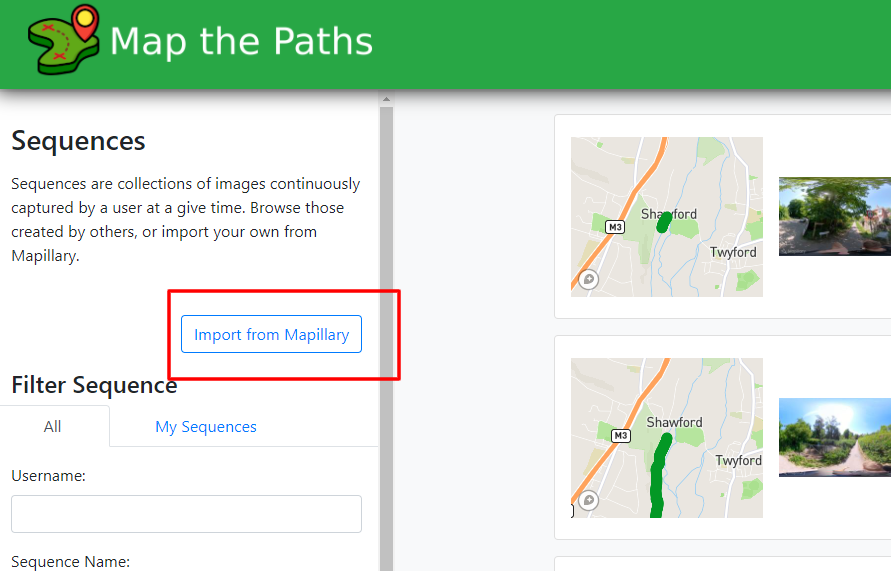
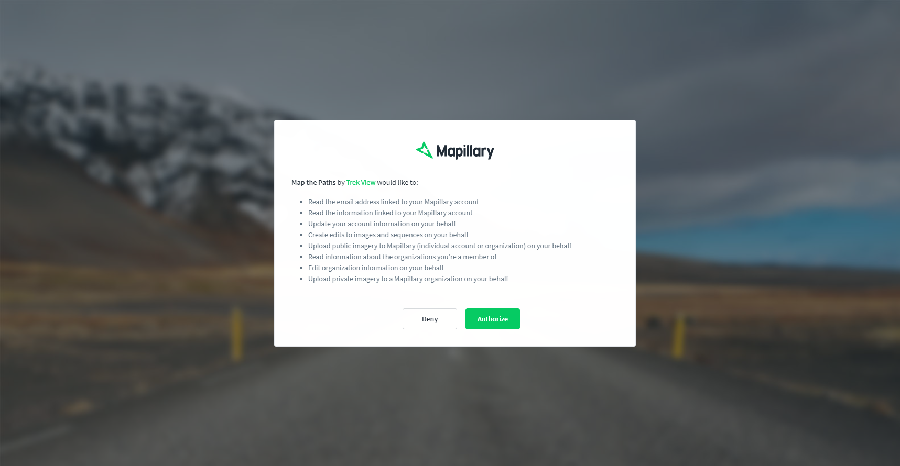
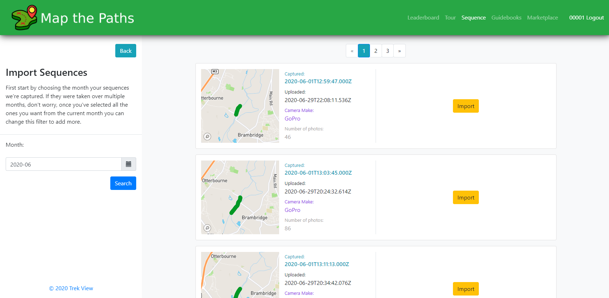
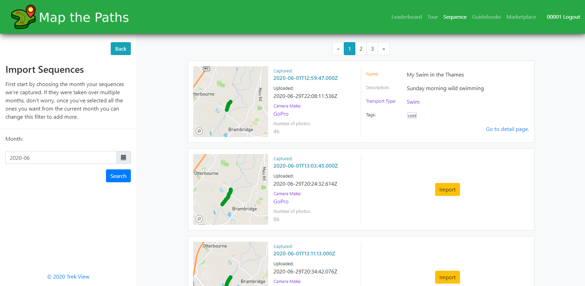

# Create

### 1. Using Map the Paths Desktop Uploader \(recommended\)

The Map the Paths Desktop Uploader will guide you through the sequence creation process whilst also letting you modify the photos or video before they are shared on both Mapillary and Map the Paths.

[Download the Map the Paths here to get started.](https://mtp.trekview.org/uploader)

###  **2. By directly importing from Mapillary**

If your imagery already exists on Mapillary you can import it as a sequence in Map the Paths. You can import a sequence from Mapillary as follows

#### **2.1 Select import**

Go the Sequences page when logged in and select the button "Import from Mapillary".

#### **2.2 Grant access**

If you are not already, you will be prompted to log into your Mapillary account. Note, you will only be able to import sequences uploaded by the account you log into Mapillary using during this step.

Once logged in, you must allow Map the Paths secure access to your Mapillary account to allow sequences to be imported.

#### **2.3 Choose the sequences you want to import**

You can now search for the Mapillary sequences you want to import to MTP.

Use the date range picker to filter the sequences by date they were captured \(NOT uploaded\).

If you see the message:

> No results match your criteria.

It means no images were uploaded to the Mapillary account you have authenticated with during the selected month in the date filter OR all sequences during this month have already been imported to Map the Paths.

When you find a sequence you want to import, click the "Import button"

#### **2.4 Add sequence metadata**

Before the Sequence is imported, you need to add some additional data. This data makes it easier for you to manage your Sequences on Map the Paths and for other users to discover them.

Once all fields are filled in, select "Import now".

You can continue to add more Sequences in this was until you've finished.

Once imported your Sequence\(s\) will be immediately searchable and visible to other Map the Paths users.

